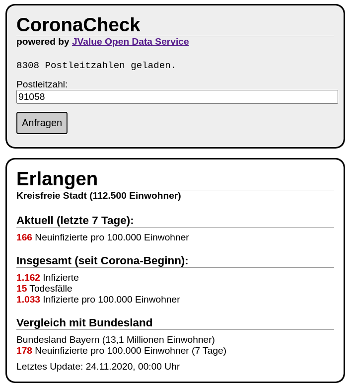

# CoronaCheck - an [ODS](https://https://github.com/jvalue/open-data-service) Example App

This repository contains CoronaCheck, an example on how to create a webapplication using the [Open Data Service](https://github.com/jvalue/open-data-service) as a backend.

CoronaCheck is a simple webpage with zero dependencies (no JS-Framework, no JQuery) that can be run locally without using a webserver.
It allows the user to access the Covid-19-pandemic data provided by the [Robert-Koch-Institut](https://www.rki.de/DE/Home/homepage_node.html) using zip codes.

# Setup

## Requirements
- running ODS instance (e.g. using the docker-compose files in https://github.com/jvalue/amos-ws20-ods-app)

## Create ODS Pipelines

The `ods`-Folder contains the URL and transformation snippet for both pipelines required by this example app.

## Adjust Data URLs

Depending on where the Open Data Service is running, if it is a new instance or in which order you created the pipelines, you might have to adjust the URLs in `src/index.js`:

```js
const ODS_ZIP_CODE_URL = 'http://localhost:9000/api/storage/1?order=id.desc&limit=1';
const ODS_CORONA_URL = 'http://localhost:9000/api/storage/2?order=id.desc&limit=1';
```

# Running the example

Open `index.html` in a web browser.

# Screenshot



# License

Copyright 2020 Friedrich-Alexander Universität Erlangen-Nürnberg

This program is free software: you can redistribute it and/or modify it under the terms of the GNU Affero General Public License as published by the Free Software Foundation, either version 3 of the License, or (at your option) any later version.

This program is distributed in the hope that it will be useful, but WITHOUT ANY WARRANTY; without even the implied warranty of MERCHANTABILITY or FITNESS FOR A PARTICULAR PURPOSE. See the GNU Affero General Public License for more details.

You should have received a copy of the GNU Affero General Public License along with this program. If not, see http://www.gnu.org/licenses/.

SPDX-License-Identifier: AGPL-3.0-only